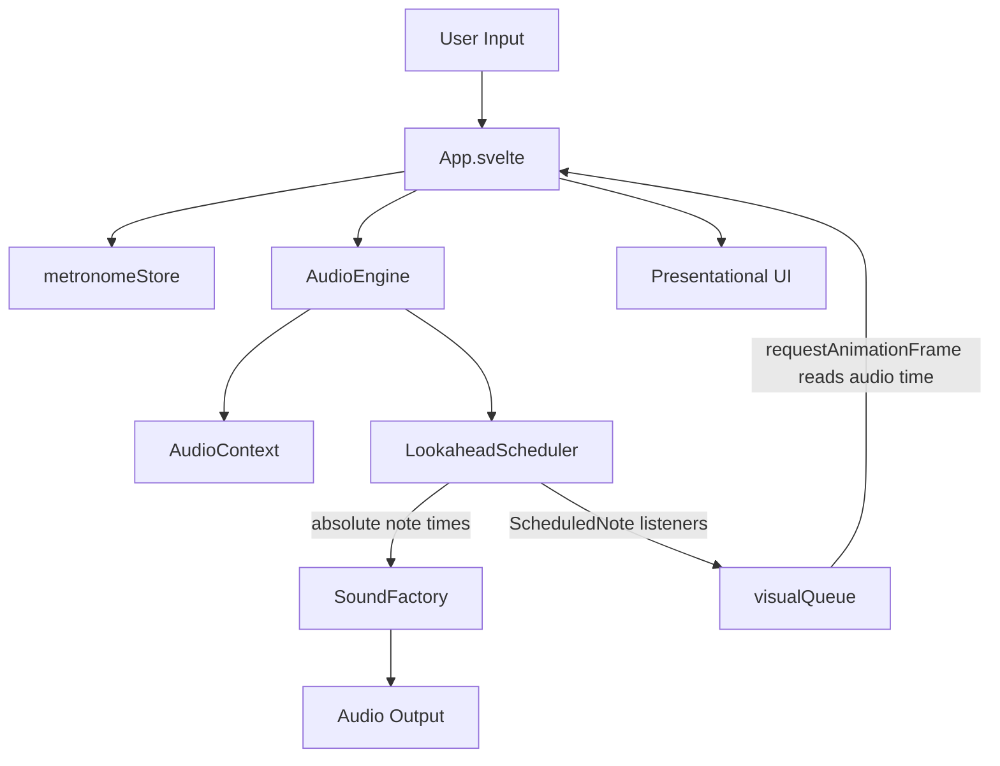

# Professional Metronome Rebuild Specification

## Purpose

This document contains the context needed to recreate the Professional Metronome app from zero. It is intended for engineers, AI agents, or a mixed team rebuilding the app without relying on the existing source files as implementation input.

The product is a precise, responsive, low-latency web metronome for musicians and students. The core engineering principle is that musical timing must be independent from UI rendering.

## Product Scope

The rebuilt app must provide:

- A browser-based metronome with Web Audio playback.
- BPM control from `30` to `400`.
- Meter presets for `2/4`, `3/4`, `4/4`, `5/4`, `6/8`, plus custom meters.
- Subdivisions for quarter, eighth, sixteenth, and triplet.
- First beat accent control.
- Sound selection between digital click, woodblock, and electronic beep.
- Volume and mute controls.
- Tap tempo.
- Visual beat and subdivision indicators synchronized to audio events.
- Keyboard shortcuts for transport, BPM changes, and tap tempo.
- PWA support with installable standalone behavior and offline-capable production assets.

Out of scope for a faithful rebuild:

- Sample-based playback unless it is explicitly added as a new feature.
- Server-side state or authentication.
- Guaranteed audio playback when a browser suspends background or lock-screen execution.
- UI-driven sound triggering.

## Stack

Use the same conservative stack:

- Svelte `5`
- TypeScript with strict settings
- Vite `6`
- Tailwind CSS `3`
- PostCSS and Autoprefixer
- Vitest
- Web Audio API
- `vite-plugin-pwa`
- npm with `package-lock.json`

The package should remain private and ESM-based:

```json
{
  "name": "professional-metronome",
  "private": true,
  "type": "module"
}
```

## Commands

Required scripts:

```bash
npm run dev
npm run build
npm run preview
npm test
npm run test:watch
npm exec tsc -- --noEmit
```

Expected script behavior:

- `dev`: run Vite and bind to `0.0.0.0`.
- `build`: create production build and generate PWA assets.
- `preview`: serve the production build and bind to `0.0.0.0`.
- `test`: run Vitest once.
- `test:watch`: run Vitest in watch mode.

## Architecture

Keep the same module boundaries:

```text
src/
  App.svelte
  main.ts
  app.css
  audio/
    AudioEngine.ts
    LookaheadScheduler.ts
    SoundFactory.ts
    PrecisionMonitor.ts
    SampleLoader.ts
    types.ts
  music/
    meter.ts
    tapTempo.ts
    tempo.ts
  state/
    metronomeStore.ts
  ui/
    components/
      BeatIndicators.svelte
      BpmDisplay.svelte
      BpmSlider.svelte
      SettingsPanel.svelte
      TransportControls.svelte
  tests/
```

Primary responsibility split:

- `App.svelte`: orchestration, UI event handlers, keyboard shortcuts, visual synchronization, and connection between store and audio engine.
- `src/audio/AudioEngine.ts`: framework-agnostic audio facade that owns `AudioContext`, master gain, scheduler, sound factory, start/stop, mute, volume, sound type, and listeners.
- `src/audio/LookaheadScheduler.ts`: timing-critical scheduler that calculates musical positions and schedules absolute audio-clock notes ahead of playback.
- `src/audio/SoundFactory.ts`: creates click sounds with Web Audio nodes.
- `src/audio/types.ts`: shared contracts for sound, subdivision, meter, scheduler settings, metronome settings, scheduled notes, and beat listeners.
- `src/music/tempo.ts`: BPM normalization, beat duration, subdivision count, subdivision duration, and tempo labels.
- `src/music/meter.ts`: meter presets, custom meter creation, denominator normalization, downbeat helper, and meter labels.
- `src/music/tapTempo.ts`: tap tempo averaging and reset behavior.
- `src/state/metronomeStore.ts`: Svelte view state and initial user settings.
- `src/ui/components`: presentational components that receive props and callbacks.

The audio package must not import Svelte stores or Svelte components.

## Flow



Detailed control flow:

1. The user interacts with Svelte UI or keyboard shortcuts.
2. `App.svelte` normalizes inputs and calls `AudioEngine` mutation methods.
3. `App.svelte` updates `metronomeStore` for view state.
4. `AudioEngine.start()` creates or resumes `AudioContext` after the user gesture.
5. `LookaheadScheduler` wakes periodically and pre-schedules notes by absolute `AudioContext.currentTime`.
6. Each scheduled note is sent to `SoundFactory.play(...)` and emitted to beat listeners.
7. `App.svelte` pushes notes into `visualQueue`.
8. `requestAnimationFrame` updates visual indicators only after `audioEngine.getCurrentTime()` reaches each scheduled note time.

## Domain Contracts

Core types:

```ts
export type SoundType = 'digitalClick' | 'woodblock' | 'electronicBeep';
export type Subdivision = 'quarter' | 'eighth' | 'sixteenth' | 'triplet';
export type MeterPreset = '2/4' | '3/4' | '4/4' | '5/4' | '6/8' | 'custom';

export type Meter = {
  preset: MeterPreset;
  numerator: number;
  denominator: 2 | 4 | 8 | 16;
};

export type ScheduledNote = {
  time: number;
  beatIndex: number;
  subdivisionIndex: number;
  isDownbeat: boolean;
  isPrimaryBeat: boolean;
};
```

Settings:

- `SchedulerSettings`: `bpm`, `meter`, `subdivision`, `accentFirstBeat`.
- `MetronomeSettings`: scheduler settings plus `volume`, `muted`, `soundType`.
- `MetronomeViewState`: metronome settings plus `isPlaying`, `activeBeatIndex`, `activeSubdivisionIndex`, `audioState`, `lastScheduledNote`.

Default settings:

- `bpm`: `120`
- `meter`: `4/4`
- `subdivision`: `quarter`
- `accentFirstBeat`: `true`
- `volume`: `0.75`
- `muted`: `false`
- `soundType`: `digitalClick`
- `isPlaying`: `false`
- `activeBeatIndex`: `0`
- `activeSubdivisionIndex`: `0`
- `audioState`: `closed`
- `lastScheduledNote`: `null`

## Music Rules

BPM:

- Minimum BPM is `30`.
- Maximum BPM is `400`.
- Non-finite BPM values normalize to `120`.
- BPM values are rounded after clamping.
- Beat duration is `60 / normalizedBpm`.

Subdivisions:

- `quarter`: `1` subdivision per beat.
- `eighth`: `2` subdivisions per beat.
- `sixteenth`: `4` subdivisions per beat.
- `triplet`: `3` subdivisions per beat.
- Subdivision duration is `beatDuration / subdivisionsPerBeat`.

Meter:

- Presets: `2/4`, `3/4`, `4/4`, `5/4`, `6/8`.
- Unknown preset falls back to custom `4/4`.
- Custom numerator is rounded and clamped to `1..16`.
- Custom denominator must be `2`, `4`, `8`, or `16`; otherwise use `4`.
- A downbeat is beat index `0`.

Tempo labels:

- `< 40`: `Grave`
- `< 60`: `Largo`
- `< 76`: `Adagio`
- `< 108`: `Andante`
- `< 120`: `Moderato`
- `< 168`: `Allegro`
- `< 200`: `Presto`
- Otherwise: `Prestissimo`

## Audio Timing Rules

These rules are non-negotiable for a faithful rebuild:

- Do not use UI rendering as the source of musical timing.
- Do not trigger click sounds from Svelte reactive statements.
- Do not rely on `Date.now()` for musical timing.
- Do not rely on `requestAnimationFrame` for musical timing.
- `setInterval` may only wake the scheduler; the note time must come from `AudioContext.currentTime`.
- Store each scheduled note time in seconds on the audio context clock.
- Advance musical position by subdivision duration, not callback delay.
- Create or resume `AudioContext` only after a user gesture.
- Do not rebuild `AudioContext` when only BPM, meter, subdivision, volume, mute, sound type, or accent settings change.
- Create fresh Web Audio nodes for each scheduled sound.

Scheduler parameters:

- Wake interval: `25ms`.
- Schedule-ahead window: `0.1s`.
- Initial next note time on start: `currentTime + 0.05s`.
- Scheduler loop condition: schedule while `nextNoteTime < currentTime + scheduleAheadTime`.
- Downbeat: `beatIndex === 0 && subdivisionIndex === 0`.
- Primary beat: `subdivisionIndex === 0`.
- After scheduling a note, increment `nextNoteTime` by `getSubdivisionDuration(bpm, subdivision)`.
- Increment `subdivisionIndex`; when it reaches the subdivisions-per-beat value, reset it to `0` and advance `beatIndex`.
- Wrap `beatIndex` by `meter.numerator`.
- When settings change, keep current position valid with modulo against the new meter and subdivision.

## Audio Engine API

The rebuilt `AudioEngine` should expose:

```ts
class AudioEngine {
  constructor(settings: MetronomeSettings);
  start(): Promise<void>;
  stop(): void;
  setBpm(bpm: number): void;
  setMeter(meter: Meter): void;
  setSubdivision(subdivision: Subdivision): void;
  setAccentFirstBeat(accentFirstBeat: boolean): void;
  setSoundType(soundType: SoundType): void;
  setVolume(volume: number): void;
  setMuted(muted: boolean): void;
  addBeatListener(listener: BeatListener): () => void;
  getCurrentTime(): number;
  getState(): AudioContextState | 'closed';
}
```

Implementation requirements:

- Use `latencyHint: 'interactive'` when creating the audio context.
- Support browser-prefixed `webkitAudioContext`.
- Create a master `GainNode` connected to `audioContext.destination`.
- Clamp volume to `0..1`.
- Preserve previous volume while muting.
- When unmuting from zero volume, restore the previous volume or `0.75`.
- Apply gain with `setTargetAtTime(gain, currentTime, 0.01)`.
- Maintain a set of beat listeners and return unsubscribe callbacks.

## Sound Design

Sound generation is oscillator-based and must schedule all starts and stops at `note.time`.

Digital click:

- Oscillator type: `square`.
- Accent frequency: `1500Hz`.
- Normal frequency: `980Hz`.
- Primary beat volume: `0.95`.
- Subdivision volume: `0.34`.
- Envelope starts at `0.0001`, ramps to volume by `note.time + 0.002`, then ramps to `0.0001` by `note.time + 0.045`.
- Stop at `note.time + 0.05`.

Woodblock:

- Oscillator type: `triangle`.
- Accent oscillator frequency: `740Hz`.
- Normal oscillator frequency: `520Hz`.
- Bandpass filter frequency: `1200Hz` accent, `880Hz` normal.
- Filter Q: `10`.
- Primary beat volume: `0.9`.
- Subdivision volume: `0.28`.
- Envelope starts at `0.0001`, ramps to volume by `note.time + 0.002`, then ramps to `0.0001` by `note.time + 0.075`.
- Stop at `note.time + 0.085`.

Electronic beep:

- Oscillator type: `sine`.
- Accent frequency: `1320Hz`.
- Normal frequency: `880Hz`.
- Primary beat volume: `0.75`.
- Subdivision volume: `0.24`.
- Envelope starts at `0.0001`, linearly ramps to volume by `note.time + 0.004`, then ramps to `0.0001` by `note.time + 0.065`.
- Stop at `note.time + 0.075`.

Accent is enabled only when `accentFirstBeat` is true and the note is a downbeat.

## UI Requirements

The UI should be mobile-friendly, large enough for touch, and responsive.

Required components:

- `BpmDisplay`: displays BPM, tempo label, and supports direct BPM changes.
- `BpmSlider`: provides continuous BPM control.
- `BeatIndicators`: displays one indicator per beat, active beat, active subdivision, first-beat accent state, and elapsed playback time.
- `TransportControls`: play/stop toggle and tap tempo action.
- `SettingsPanel`: meter, subdivision, sound type, volume, mute, and accent controls.

Component rules:

- Components should be presentational where possible.
- Components receive data through props.
- Components emit user intent through callbacks.
- Components must not import or mutate `AudioEngine`.
- Components must not trigger Web Audio playback.

Keyboard shortcuts:

- `Space`: toggle playback.
- `ArrowUp` or `ArrowRight`: increase BPM by `1`.
- `Shift + ArrowUp` or `Shift + ArrowRight`: increase BPM by `5`.
- `ArrowDown` or `ArrowLeft`: decrease BPM by `1`.
- `Shift + ArrowDown` or `Shift + ArrowLeft`: decrease BPM by `5`.
- `T`: tap tempo.
- Ignore shortcuts while focus is inside an input or select.

Elapsed time:

- Elapsed playback display may use `Date.now()` and `setInterval` because it is not musical timing.
- Reset elapsed time when playback stops.

## Tap Tempo

Tap tempo should:

- Register user taps and compute BPM from recent intervals.
- Normalize the resulting BPM through the same `30..400` rules.
- Reset after stale taps.
- Avoid producing a BPM from a single tap.
- Be covered by unit tests for averaging and reset behavior.

## PWA And Assets

Use `vite-plugin-pwa` with:

- `registerType: 'autoUpdate'`
- `includeAssets: ['favicon.svg']`
- `display: 'standalone'`
- `orientation: 'portrait'`
- `start_url: '/'`
- `theme_color: '#303349'`
- `background_color: '#303349'`
- App name: `Professional Metronome`
- Short name: `Metronome`
- Description: `A precise web metronome for professional musicians and students.`
- Icon: `/icons/icon.svg`, type `image/svg+xml`, sizes `any`, purpose `any maskable`
- Workbox glob patterns for `js`, `css`, `html`, `svg`, `woff2`, `wav`, and `ogg`

Required public assets:

- `public/favicon.svg`
- `public/icons/icon.svg`

Production build should generate:

- `dist/manifest.webmanifest`
- `dist/sw.js`
- `dist/registerSW.js`

## Browser Constraints

Document these limitations in user-facing or developer documentation:

- Browsers may throttle timers in background tabs.
- Mobile browsers may suspend audio when the screen locks or the app is backgrounded.
- Safari and iOS enforce stricter audio policies.
- Web Audio pre-scheduling reduces timing risk but does not guarantee lock-screen playback.

## Testing Specification

Use Vitest in a Node environment. Keep tests deterministic and avoid relying on real browser audio output.

Required test areas:

- BPM clamping and non-finite fallback.
- Beat duration calculation.
- Subdivision counts and subdivision durations.
- Meter presets and custom meter normalization.
- Downbeat detection.
- Tap tempo averaging.
- Tap tempo reset behavior.
- Scheduler note ordering.
- Scheduler absolute scheduling based on the audio clock.
- Scheduler position wrapping across beats, subdivisions, and meters.
- Precision monitor drift sampling helpers.

Commands to run after timing, meter, BPM, tap tempo, scheduler, or audio-engine changes:

```bash
npm test
npm exec tsc -- --noEmit
npm run build
```

Vitest should run single-threaded when the environment can deny worker termination:

```ts
test: {
  environment: 'node',
  include: ['src/tests/**/*.test.ts'],
  pool: 'threads',
  poolOptions: {
    threads: {
      singleThread: true
    }
  }
}
```

## Acceptance Criteria

A rebuild is complete when:

- The app starts with `120 BPM`, `4/4`, quarter notes, accent enabled, digital click, volume `0.75`, and stopped playback.
- Pressing play after a user gesture starts scheduled Web Audio playback.
- Pressing stop halts scheduling and resets visual active beat/subdivision.
- BPM cannot go below `30` or above `400`.
- Meter and subdivision changes update audio scheduling without rebuilding the audio context.
- Visual indicators follow the scheduled audio clock.
- Tap tempo updates BPM after enough taps.
- Mute and volume behave independently and predictably.
- PWA manifest and service worker assets are generated by the production build.
- The full validation command set passes.

## Agent Specification

Use multiple focused agents when rebuilding. Each agent must receive this document as shared context and must preserve the audio timing rules.

### product-spec-agent

Purpose:

- Convert the current product behavior into implementation-ready requirements.
- Keep UX, accessibility, mobile ergonomics, and musician workflows explicit.

Required skills:

- Product specification writing.
- Music terminology and metronome behavior.
- Accessibility for touch and keyboard controls.
- PWA user expectations.

Inputs:

- This rebuild specification.
- Screenshots or current UI recordings if available.
- Any branding requirements.

Outputs:

- Functional requirements.
- UX acceptance criteria.
- Edge cases for BPM, meter, subdivision, and tap tempo.

Prompt:

```text
You are the product-spec-agent for a web metronome rebuild.
Use docs/rebuild-spec.md as the source of truth.
Produce implementation-ready requirements for a precise, responsive, PWA metronome.
Preserve all timing constraints, keyboard shortcuts, controls, defaults, and browser limitations.
Do not invent features outside the rebuild scope unless clearly marked as optional.
```

### audio-engine-agent

Purpose:

- Rebuild the framework-agnostic audio layer.
- Implement timing, scheduling, sound generation, and listener contracts.

Required skills:

- Web Audio API.
- Absolute-time scheduling.
- TypeScript class design.
- Deterministic unit testing for scheduling code.

Inputs:

- Domain contracts from this document.
- Music helper behavior.
- Test requirements.

Outputs:

- `src/audio/types.ts`
- `src/audio/AudioEngine.ts`
- `src/audio/LookaheadScheduler.ts`
- `src/audio/SoundFactory.ts`
- `src/audio/PrecisionMonitor.ts`
- Audio and scheduler tests.

Prompt:

```text
You are the audio-engine-agent for a Svelte TypeScript metronome rebuild.
Implement the audio package without importing Svelte.
Use AudioContext.currentTime for musical timing.
Use setInterval only as a wake-up mechanism with a 25ms lookahead tick and 100ms schedule-ahead window.
Schedule oscillator starts and stops at absolute note times.
Keep the AudioEngine API, settings, defaults, and listener behavior described in docs/rebuild-spec.md.
Add focused Vitest coverage for timing and scheduler behavior.
```

### ui-svelte-agent

Purpose:

- Rebuild the Svelte app shell, state store, and presentational components.

Required skills:

- Svelte 5.
- TypeScript props and callbacks.
- Tailwind responsive UI.
- Keyboard event handling.
- Accessible form controls.

Inputs:

- Product requirements.
- AudioEngine public API.
- Store contract.

Outputs:

- `src/App.svelte`
- `src/state/metronomeStore.ts`
- `src/ui/components/*.svelte`
- `src/main.ts`
- `src/app.css`

Prompt:

```text
You are the ui-svelte-agent for a professional metronome rebuild.
Implement Svelte components as presentational components using props and callbacks.
Route all audio mutations through AudioEngine from App.svelte.
Keep visual beat updates driven by scheduled notes and AudioEngine.getCurrentTime().
Do not trigger click sounds from reactive statements or UI components.
Implement the keyboard shortcuts and responsive touch-friendly layout from docs/rebuild-spec.md.
```

### pwa-build-agent

Purpose:

- Rebuild project tooling, Tailwind, Vite, TypeScript, and PWA configuration.

Required skills:

- Vite.
- `vite-plugin-pwa`.
- TypeScript configuration.
- Tailwind and PostCSS.
- npm package hygiene.

Inputs:

- Stack and PWA requirements from this document.
- Public asset requirements.

Outputs:

- `package.json`
- `package-lock.json`
- `vite.config.ts`
- `tsconfig.json`
- `tsconfig.node.json`
- `tailwind.config.cjs`
- `postcss.config.cjs`
- `index.html`
- `public/favicon.svg`
- `public/icons/icon.svg`

Prompt:

```text
You are the pwa-build-agent for a Svelte TypeScript metronome rebuild.
Configure Vite, Svelte, Tailwind, TypeScript, Vitest, and vite-plugin-pwa according to docs/rebuild-spec.md.
Keep dependencies conservative.
Ensure npm scripts, PWA manifest fields, Workbox glob patterns, and test configuration match the specification.
Do not add unrelated build tools.
```

### test-validation-agent

Purpose:

- Validate the rebuilt app against the specification.
- Strengthen tests around high-risk timing and music rules.

Required skills:

- Vitest.
- TypeScript test doubles.
- Scheduler and time simulation.
- Build validation.

Inputs:

- Completed implementation.
- This specification.

Outputs:

- Test gap report.
- Additional tests where needed.
- Final validation results for `npm test`, `npm exec tsc -- --noEmit`, and `npm run build`.

Prompt:

```text
You are the test-validation-agent for a web metronome rebuild.
Audit the implementation against docs/rebuild-spec.md.
Focus on timing, scheduler note order, BPM bounds, meter normalization, tap tempo, and PWA build output.
Add or update tests only where they prove specified behavior.
Run npm test, npm exec tsc -- --noEmit, and npm run build.
Report any residual browser risks separately from code failures.
```

## Skill Matrix

Required skills by rebuild area:

- Product: metronome behavior, musician workflow, accessibility, mobile controls.
- Audio: Web Audio API, oscillator synthesis, gain envelopes, absolute scheduling.
- Timing: audio clock scheduling, lookahead loops, deterministic tests.
- Domain: BPM clamping, meter normalization, subdivisions, tap tempo.
- UI: Svelte 5, TypeScript, Tailwind CSS, keyboard shortcuts.
- PWA: Vite PWA plugin, manifest, service worker generation, public assets.
- Validation: Vitest, TypeScript strict checks, production build verification.

## Documentation To Create In A Fresh Rebuild

A fresh rebuild should include:

- `README.md`: installation, scripts, usage, keyboard shortcuts, PWA notes, browser limitations.
- `docs/rebuild-spec.md`: this document or an updated derivative.
- `docs/audio-timing.md`: deeper explanation of scheduler decisions and browser constraints.
- `docs/testing.md`: test strategy and validation commands.
- `CLAUDE.md` or equivalent agent guidance: architecture, timing rules, coding guidelines, and common pitfalls.

## Rebuild Checklist

1. Initialize Vite Svelte TypeScript project.
2. Add Tailwind, PostCSS, Vitest, and PWA plugin.
3. Configure TypeScript, Vite, Vitest, and PWA manifest.
4. Create domain types in `src/audio/types.ts`.
5. Implement pure music helpers in `src/music`.
6. Add unit tests for music helpers.
7. Implement `LookaheadScheduler` with absolute audio times.
8. Add scheduler tests with fake current time and schedule callback.
9. Implement `SoundFactory`.
10. Implement `AudioEngine`.
11. Implement `metronomeStore` defaults and view state.
12. Build presentational Svelte components.
13. Wire orchestration in `App.svelte`.
14. Add keyboard shortcuts and visual synchronization queue.
15. Add PWA public assets.
16. Run `npm test`.
17. Run `npm exec tsc -- --noEmit`.
18. Run `npm run build`.
19. Manually verify playback, BPM boundaries, meter changes, subdivisions, tap tempo, mute, volume, PWA installability, and mobile layout.

## Common Pitfalls

- Triggering sound from UI state changes.
- Using `requestAnimationFrame` as the source of musical timing.
- Using `Date.now()` for scheduled notes.
- Reusing an `AudioBufferSourceNode` or oscillator for multiple notes.
- Recreating `AudioContext` for ordinary setting changes.
- Updating global Svelte store on every scheduler tick before the note is due.
- Letting visual indicators run ahead of audio.
- Forgetting browser audio gesture requirements.
- Claiming background or lock-screen playback is guaranteed.
- Expanding dependencies without a concrete product or testing need.
